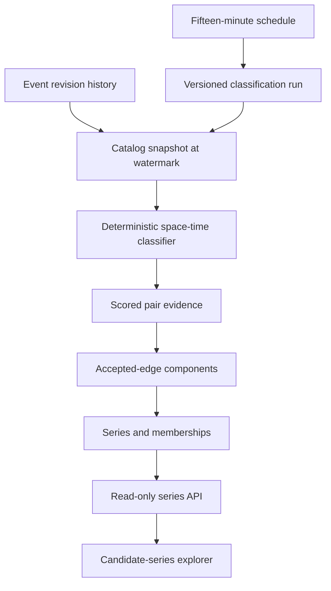

# Candidate seismic series

## Classification flow

## Reproducibility boundary

A run records its analysis interval, catalog watermark, algorithm name and version, and every
numeric parameter. The input query reconstructs the newest source revision observable at that
watermark rather than reading today's mutable canonical projection. Reclassification therefore
creates a new auditable result instead of rewriting a previous run.

## Version 1 scoring

The classifier evaluates pairs inside magnitude-adjusted time and distance windows. Its score is a
configured weighted sum of normalized time proximity, geographic proximity, and magnitude
similarity. Accepted edges form connected components; components smaller than the configured
minimum are omitted. Mainshock selection uses magnitude, then origin time, then stable event ID.

Membership explanations retain the strongest accepted edge touching each event. They expose the
related event, time separation in seconds, great-circle distance in kilometres, matched rule, and
edge score.

## Scientific limitation

These results are candidate, inferred relationships produced by a transparent engineering
heuristic. They are not reviewed scientific determinations, do not establish causality, and must not
be used to predict earthquakes or make safety decisions.
