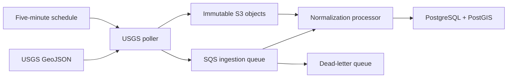

# Catalog ingestion

## Flow

The poller stores the complete USGS response as a manifest and each feature as a deterministic raw
object. An event message is published only after its raw object is durable. The processor retrieves
the object, verifies its SHA-256 checksum and source identity, validates the USGS boundary schema,
normalizes the record, and writes the revision transactionally.

## Identity and idempotency

- Source identity: `(source, source_event_id)`
- Revision identity: `(source_event, source_updated_at, payload_checksum)`
- Raw key: source, event date, source ID, source update epoch, and checksum
- Canonical projection: newest source update, with equal timestamps resolved deterministically by
  payload checksum

An older revision arriving late is retained but does not replace the current projection.

## Historical backfill

The local backfill command partitions the requested interval into one-day FDSN queries by default.
This keeps each query below the USGS 20,000-result limit. A partition that reaches the limit fails
explicitly instead of silently accepting a truncated catalog.

## Failure behavior

- USGS HTTP 429 and 5xx responses retry up to three attempts with exponential backoff and support
  for `Retry-After`.
- One event that cannot be stored or queued does not discard other events in the response.
- The SQS consumer reports individual record failures, allowing successful messages in the same
  batch to remain acknowledged.
- After five receives, an unsuccessful message moves to the retained dead-letter queue.
- Invalid schemas, mismatched IDs or timestamps, and checksum failures are terminal until the
  underlying raw record or code is corrected and the message is replayed.

## Deployment note

The reference CDK stack uses private Lambda functions, encrypted RDS PostgreSQL, encrypted S3 and
SQS, one NAT gateway for USGS access, a deployment-time schema migration function, and generated
database credentials in Secrets Manager. The NAT gateway and RDS instance incur continuous cost;
destroy nonessential environments and review retained S3, DLQ, and database snapshots separately.
