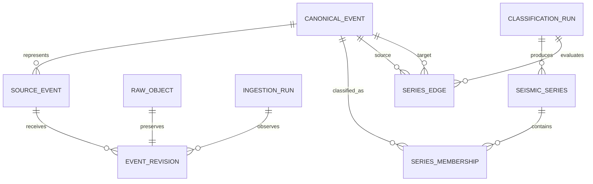

# Earthquake Intelligence Platform

## Version 1 Product Requirements and Domain Model

**Status:** Draft 0.1  
**Primary goal:** Engineering demonstration  
**Working release name:** Event Explorer

## 1. Product vision

Build a production-oriented platform that ingests live earthquake data, preserves its provenance and revision history, groups events into explainable candidate seismic series, presents the results through an animated geospatial dashboard, and answers grounded questions about the data.

Version 1 is intended to demonstrate engineering judgment and implementation quality. It is not intended to produce novel seismological research or predict earthquakes.

## 2. Portfolio narrative

The system demonstrates:

- Idempotent ingestion from an evolving external scientific catalog.
- Event-driven processing with retries and dead-letter handling.
- Reconciliation of mutable source records into a canonical model.
- Temporal and geospatial queries with PostgreSQL and PostGIS.
- Reproducible, versioned analytical processing.
- Coordinated state across maps, timelines, filters, details, and chat.
- Safe LLM integration using typed read-only tools and citations.
- Infrastructure as code, automated testing, observability, and CI/CD.

## 3. Version 1 boundaries

### In scope

- Backfill a bounded historical window from the USGS earthquake catalog.
- Poll a USGS GeoJSON feed every five minutes.
- Store immutable raw source payloads.
- Normalize source events into a queryable canonical catalog.
- Preserve every observed event revision.
- Handle duplicate delivery and safe retries.
- Group events into candidate seismic series using a deterministic, configurable space-time algorithm.
- Display events on an animated map and timeline.
- Display event details, provenance, revisions, and series membership.
- Provide a chatbot that answers a defined set of questions through read-only catalog tools.
- Include deployment automation, tests, metrics, logs, and distributed traces.

### Explicitly out of scope

- Earthquake prediction or probabilistic hazard claims.
- Custom foundation-model training.
- Common Crawl ingestion.
- Continuous SeedLink ingestion.
- Full waveform ingestion and seismogram rendering.
- Multi-catalog reconciliation between USGS, ISC, and regional catalogs.
- ETAS, Reasenberg, or machine-learning classification.
- Native mobile applications.

These exclusions are candidates for later releases, not discarded ideas.

## 4. Users and primary journeys

### Visitor

A visitor can explore recent earthquakes, change map and time filters, inspect an event, view its source history, examine its candidate seismic series, and ask factual questions about the catalog.

### Engineering reviewer

An engineering reviewer can understand the architecture, run the system locally, inspect traces and metrics, replay duplicate or revised records, and verify the system's failure and recovery behavior.

### Administrator

An administrator can inspect ingestion runs, failed messages, classification runs, and data freshness. Version 1 may expose this through operational endpoints and cloud tooling rather than a dedicated admin interface.

## 5. Functional requirements

### 5.1 Ingestion

| ID | Requirement | Acceptance criteria |
| --- | --- | --- |
| ING-01 | The system shall poll a configured USGS GeoJSON feed every five minutes. | A successful run records its start, completion, source watermark, counts, and duration. |
| ING-02 | The system shall support a bounded historical backfill through the USGS FDSN event API. | An operator can specify start time, end time, and minimum magnitude without changing code. |
| ING-03 | The system shall save the unmodified source payload before normalization. | Every normalized source-event version references an immutable raw object and checksum. |
| ING-04 | The system shall tolerate duplicate message delivery. | Replaying an identical payload creates no duplicate revision or canonical event. |
| ING-05 | The system shall retain meaningful USGS revisions. | A payload with the same source event ID and a new source update timestamp creates a new revision and updates the current projection. |
| ING-06 | The system shall retry transient failures and isolate terminal failures. | Transient failures retry with backoff; exhausted or invalid messages enter a dead-letter queue with diagnostic context. |
| ING-07 | The system shall expose catalog freshness. | The API reports the latest successful source watermark and last successful ingestion time. |

### 5.2 Catalog and queries

| ID | Requirement | Acceptance criteria |
| --- | --- | --- |
| CAT-01 | The system shall store event time, location, depth, magnitude, magnitude type, place, status, significance, and felt-report count when supplied. | Values are queryable and retain source attribution. |
| CAT-02 | The system shall distinguish canonical events from source records and revisions. | The data model can later add another catalog without changing canonical event identity rules. |
| CAT-03 | The API shall filter events by time, magnitude, depth, geographic bounds, and series. | Filters can be composed and pagination is deterministic. |
| CAT-04 | The API shall support radius searches. | A caller can request events within a distance of a latitude/longitude, and results include computed distance. |
| CAT-05 | The API shall expose an event's revision history. | The response shows changed fields, source timestamps, and observation timestamps. |
| CAT-06 | The API shall use UTC and unambiguous units. | Times are ISO 8601 UTC; depth and distance are documented in kilometres. |

### 5.3 Candidate seismic series

| ID | Requirement | Acceptance criteria |
| --- | --- | --- |
| SER-01 | The system shall group events using a deterministic space-time algorithm. | The same input snapshot, algorithm version, and parameters produce the same memberships. |
| SER-02 | Classification shall run against a defined catalog watermark. | Every run records the input watermark and the time range processed. |
| SER-03 | Every membership shall be explainable. | The record includes the related event, temporal separation, spatial separation, rule matched, and confidence score. |
| SER-04 | Results shall be versioned rather than overwritten. | Previous runs and memberships remain available for comparison and audit. |
| SER-05 | The UI shall label results as candidate or inferred relationships. | No presentation implies that membership is an authoritative scientific determination. |
| SER-06 | The system shall support reclassification. | A later, larger event can produce a new run with a different mainshock candidate without destroying earlier output. |

### 5.4 Dashboard

| ID | Requirement | Acceptance criteria |
| --- | --- | --- |
| UI-01 | The dashboard shall display earthquakes on an interactive global map. | Markers encode magnitude and depth and remain usable at the agreed performance target. |
| UI-02 | The dashboard shall animate events across a selected time interval. | Users can play, pause, scrub, and change playback speed. |
| UI-03 | Filters shall update the map, timeline, and visible totals consistently. | Time, magnitude, depth, and geographic filters share one canonical UI state. |
| UI-04 | Selecting an event shall open a facts panel. | The panel includes event facts, source link, timestamps, coordinates, status, and revision count. |
| UI-05 | The dashboard shall visualize candidate series. | Selecting a series highlights its members, mainshock candidate, sequence, and classification explanation. |
| UI-06 | UI state shall be deep-linkable. | A URL can restore the selected event or series and primary filters. |
| UI-07 | The dashboard shall show freshness and degraded states. | Users can distinguish fresh data, delayed ingestion, API failure, and empty results. |

### 5.5 Chatbot

| ID | Requirement | Acceptance criteria |
| --- | --- | --- |
| CHAT-01 | The chatbot shall answer catalog questions using typed, read-only tools. | The model cannot execute arbitrary SQL or mutate data. |
| CHAT-02 | Version 1 shall support a bounded question set. | Supported intents include event search, event details, largest events, nearby events, series details, and series comparison. |
| CHAT-03 | Answers shall cite catalog records. | Factual claims include navigable event or series references and the relevant time range. |
| CHAT-04 | The chatbot shall expose uncertainty and limitations. | Inferred memberships are described as inferred; prediction requests receive a clear limitation. |
| CHAT-05 | The application shall validate tool inputs and outputs. | Coordinates, date ranges, pagination, magnitude ranges, and result sizes are constrained server-side. |
| CHAT-06 | The system shall trace model and tool activity without storing secrets. | Traces include latency, selected tool, token usage, and result count with appropriate redaction. |

## 6. Initial chatbot tool contract

| Tool | Purpose |
| --- | --- |
| `search_events` | Search by time, magnitude, depth, bounds, radius, and series. |
| `get_event` | Retrieve facts, provenance, current values, and revisions for one event. |
| `get_nearby_events` | Find events within a radius of an event or coordinate. |
| `get_largest_events` | Rank events within a bounded time and geographic selection. |
| `get_series` | Retrieve a candidate series, members, mainshock candidate, and classification run. |
| `compare_series` | Compare two or more series using deterministic aggregate statistics. |

The API owns authorization, validation, query limits, and formatting. The model never receives database credentials.

## 7. Initial series algorithm

Version 1 uses an intentionally transparent algorithm:

1. Select events inside a configured analysis interval and region.
2. Order events by origin time and stable event ID.
3. Produce candidate edges when two events fall within configured temporal and spatial windows.
4. Adjust the allowed window using the larger event's magnitude.
5. Score each edge from normalized time, distance, and magnitude relationships.
6. Form candidate series from connected components above a configured threshold.
7. Choose the largest-magnitude event as the mainshock candidate, using origin time and stable ID as deterministic tie-breakers.
8. Persist the run, parameters, edges, explanations, and memberships.

The exact window functions and thresholds must live in configuration, be recorded on every run, and be covered by fixture-based tests. They must not be described as scientifically authoritative.

## 8. Domain model



### Core entities

#### `canonical_event`

The application's stable representation of a physical event.

- `id` UUID
- `origin_time` timestamptz
- `hypocenter` geography(PointZ, 4326), or point plus explicit depth
- `depth_km` numeric
- `preferred_magnitude` numeric
- `preferred_magnitude_type` text
- `place` text
- `status` text
- `significance` integer
- `felt_reports` integer
- `current_source_revision_id` UUID
- `first_observed_at` timestamptz
- `last_observed_at` timestamptz
- `created_at`, `updated_at`

The implementation should confirm whether PointZ works cleanly with the selected ORM and query tooling. Keeping depth as an explicit column is acceptable and may be clearer.

#### `source_event`

The identity assigned by an external catalog.

- `id` UUID
- `source` text, initially `usgs`
- `source_event_id` text
- `canonical_event_id` UUID
- `source_url` text
- `first_observed_at`, `last_observed_at`
- Unique constraint on `(source, source_event_id)`

#### `event_revision`

One distinct version observed for a source event.

- `id` UUID
- `source_event_id` UUID
- `source_updated_at` timestamptz
- `observed_at` timestamptz
- `payload_checksum` text
- `raw_object_id` UUID
- Normalized scientific fields
- `normalizer_version` text
- Unique constraint on `(source_event_id, source_updated_at, payload_checksum)`

#### `raw_object`

Pointer and integrity information for immutable source data.

- `id` UUID
- `storage_key` text
- `content_type` text
- `checksum` text
- `byte_length` bigint
- `captured_at` timestamptz

#### `ingestion_run`

Operational record of one poll or backfill partition.

- `id` UUID
- `source` text
- `mode` enum: `poll`, `backfill`, `replay`
- `status` enum: `running`, `succeeded`, `partially_failed`, `failed`
- `requested_start`, `requested_end`
- `source_watermark`
- Counts for fetched, unchanged, created, revised, and failed records
- `started_at`, `completed_at`
- `error_summary`

#### `classification_run`

Reproducible execution of a series algorithm.

- `id` UUID
- `algorithm` text
- `algorithm_version` text
- `parameters` jsonb
- `catalog_watermark` timestamptz
- `analysis_start`, `analysis_end`
- `status`
- `started_at`, `completed_at`
- Input, series, membership, and failure counts

#### `seismic_series`

One candidate cluster produced by one classification run.

- `id` UUID
- `classification_run_id` UUID
- `mainshock_candidate_event_id` UUID
- `start_time`, `end_time`
- `event_count`
- `maximum_magnitude`
- `centroid` geography(Point, 4326)
- `display_name`

#### `series_membership`

An event's inferred membership in a candidate series.

- `series_id` UUID
- `canonical_event_id` UUID
- `role` enum: `earlier_event`, `mainshock_candidate`, `later_event`, `unclassified`
- `confidence` numeric
- `explanation` jsonb
- Primary key on `(series_id, canonical_event_id)`

#### `series_edge`

The evidence linking two events during classification.

- `classification_run_id` UUID
- `source_event_id` UUID
- `target_event_id` UUID
- `time_delta_seconds` bigint
- `distance_km` numeric
- `magnitude_delta` numeric
- `score` numeric
- `rule` text
- `accepted` boolean

## 9. API surface

```text
GET  /v1/events
GET  /v1/events/{eventId}
GET  /v1/events/{eventId}/revisions
GET  /v1/events/{eventId}/nearby
GET  /v1/series
GET  /v1/series/{seriesId}
GET  /v1/classification-runs/{runId}
GET  /v1/system/freshness
POST /v1/chat
```

Administrative ingestion, replay, and classification operations should not share the public API authorization boundary.

## 10. Quality attributes

### Reliability

- At-least-once delivery is assumed; consumers must be idempotent.
- No acknowledged source payload may be lost before durable raw storage.
- Failed messages must retain enough context for safe replay.
- One malformed event must not fail an entire feed poll.

### Performance

Provisional targets for the portfolio release:

- Event-list API p95 under 500 ms for normal bounded queries.
- Event-detail API p95 under 300 ms.
- Initial dashboard usable within 3 seconds on a typical broadband connection.
- Smooth map interaction with 25,000 visible events on a reference laptop.
- Chat responses stream their first visible content within 2 seconds, excluding unusually slow model-provider conditions.

These targets should be validated and revised using measured baselines.

### Security

- Public endpoints are read-only and rate-limited.
- Administrative endpoints require separate authentication and authorization.
- Database and model-provider credentials remain server-side in managed secret storage.
- Tool inputs use explicit schemas and bounded result sizes.
- Logs and traces redact secrets and unnecessary user content.
- Dependency and container scanning run in CI.

### Observability

- Propagate a correlation ID from ingestion run through queued processing.
- Emit structured logs and OpenTelemetry traces.
- Track feed freshness, ingestion latency, duplicate rate, revision rate, normalization failures, DLQ depth, API latency, classification duration, chat tool errors, and model cost.
- Provide a dashboard and at least three actionable alerts.

### Accessibility and usability

- Primary workflows are keyboard accessible.
- Magnitude and depth are not communicated through color alone.
- Animations support pause and reduced-motion preferences.
- Map selections have equivalent textual details.

## 11. Testing strategy

- Unit tests for normalization, identity keys, window functions, scoring, and chatbot argument validation.
- Property-based tests for ingestion idempotency and deterministic classification.
- Contract tests against saved USGS fixtures rather than live endpoints in CI.
- Integration tests using PostgreSQL/PostGIS and the queue adapter.
- End-to-end tests for map filtering, event selection, series selection, deep links, and representative chat questions.
- Replay tests for duplicate, out-of-order, revised, malformed, and partially missing source records.
- Load tests for dense map bounds and common event queries.

## 12. Demonstration scenarios

The portfolio demonstration should show:

1. A new USGS event moving from poll to queue, raw storage, normalization, and dashboard.
2. The same record replayed without producing a duplicate.
3. A revised record updating the current event while preserving history.
4. A malformed record entering failure handling without blocking valid events.
5. A classification run grouping events and exposing its reasoning.
6. A chatbot question invoking a typed tool and linking its answer to dashboard records.
7. A trace connecting each stage of one ingestion flow.

## 13. Proposed implementation increments

### Increment 0 — Foundation

- Monorepo, local development environment, formatting, linting, test framework, CI, infrastructure skeleton, and architectural decision records.

### Increment 1 — Catalog ingestion

- USGS client, polling scheduler, queue, raw storage, normalization worker, PostGIS schema, idempotency, and revision history.

### Increment 2 — Event explorer

- Event API, map, filters, timeline, facts panel, deep links, loading and degraded states.

### Increment 3 — Candidate series

- Versioned classifier, run records, memberships, evidence, series API, and series visualization.

### Increment 4 — Conversational interface

- Typed catalog tools, model orchestration, streamed responses, record citations, validation, rate limits, and evaluation cases.

### Increment 5 — Production polish

- Load testing, dashboards, alerts, security scanning, public deployment, demonstration fixtures, architecture documentation, and demo video.

## 14. Definition of done for version 1

Version 1 is complete when:

- All in-scope functional requirements have automated acceptance coverage or a documented manual verification procedure.
- The public environment processes scheduled USGS updates without operator intervention.
- Duplicate and revised payload demonstrations succeed.
- The dashboard supports the complete visitor journey.
- Series results expose their algorithm, parameters, run, and evidence.
- The chatbot passes a versioned evaluation set for supported intents and limitations.
- Operational dashboards and alerts are active.
- A new developer can run the system locally from documented instructions.
- Architecture, scientific limitations, costs, and principal tradeoffs are documented.

## 15. Decisions to confirm before implementation

1. **Backend framework:** NestJS or Fastify with a lighter internal structure.
2. **Infrastructure:** AWS SAM or CDK.
3. **Repository:** pnpm workspaces with Turborepo, or plain pnpm workspaces.
4. **Initial historical window:** Suggested default is the latest 12 months with magnitude 2.5 or greater.
5. **Authentication:** Fully public read-only v1, or optional user accounts for saved views and chat history.
6. **Deployment budget:** A monthly ceiling should be set before choosing managed database and tracing retention settings.

## 16. Recommended defaults

For a focused engineering demonstration:

- NestJS for the API and ingestion services.
- Python only when waveform or advanced scientific processing enters scope.
- AWS CDK for infrastructure, written in TypeScript.
- pnpm workspaces without Turborepo until build time justifies it.
- React, TypeScript, Vite, MobX-state-tree, MapLibre GL, and deck.gl.
- PostgreSQL 16+ with PostGIS.
- LocalStack only where it adds value; prefer narrow adapters and real-service integration tests in a non-production AWS environment.
- Public read-only application with no user accounts in v1.
- Latest 12 months and magnitude 2.5+ for the initial historical import.

